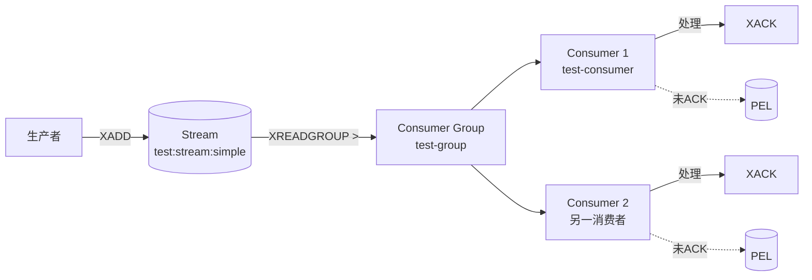

# RedisStream 结合 SDR 实现消息队列

基于 `redis-demo` 项目中 [RedisConfig.java](file:///d:/1STUDYSPACE/project_study/demo/redis-demo/src/main/java/com/redis/config/RedisConfig.java) 的实战经验总结。

## 核心概念

> [!info] Redis Stream 是什么
> Redis 5.0 引入的数据结构，天然支持消息队列场景：持久化、消费组、消费者、ACK 机制、消息回溯。相比 Pub/Sub 的"发即忘"，Stream 保证消息不丢失。

| 概念 | 说明 | Redis 命令 |
|------|------|-----------|
| **Stream** | 消息流（一个键） | `XADD` / `XLEN` / `XRANGE` |
| **Consumer Group** | 消费者组，同组内消费者分摊消息 | `XGROUP CREATE` |
| **Consumer** | 组内具体消费者，首次 `XREADGROUP` 时自动创建 | `XINFO CONSUMERS` |
| **PEL** | Pending Entries List，已投递未 ACK 的消息 | `XPENDING` / `XCLAIM` |
| **ACK** | 确认消费完成 | `XACK` |

---

## 实现步骤

### 步骤 1：创建 Stream 和消费者组

> [!warning] 必须前置
> `StreamMessageListenerContainer` 只负责消费，**不会自动创建** Stream 和消费者组。缺失会持续抛 `NOGROUP` 异常。

```java
// XADD 会自动创建 Stream（无需预先存在）
String streamKey = "test:stream:simple";
String groupName = "test-group";

if (Boolean.FALSE.equals(redisTemplate.hasKey(streamKey))) {
    redisTemplate.opsForStream().add(streamKey, Map.of("init", "1"));
}

// 创建消费者组（用 try-catch 保证幂等，已存在会抛 BUSYGROUP）
try {
    redisTemplate.opsForStream().createGroup(streamKey, ReadOffset.from("0"), groupName);
} catch (Exception e) {
    log.info("消费者组已存在：{}", e.getMessage());
}
```

> [!tip] 幂等性
> `createGroup` 在组已存在时会抛 `BUSYGROUP`，必须 catch 掉，否则应用启动失败。

### 步骤 2：配置线程池

```java
ThreadPoolTaskExecutor executor = new ThreadPoolTaskExecutor();
executor.setCorePoolSize(4);
executor.setMaxPoolSize(8);
executor.setQueueCapacity(100);
executor.setThreadNamePrefix("stream-listener-");
executor.initialize();
```

### 步骤 3：构建监听器容器

```java
StreamMessageListenerContainer<String, MapRecord<String, String, String>> container =
        StreamMessageListenerContainer.create(factory,
                StreamMessageListenerContainer.StreamMessageListenerContainerOptions.builder()
                        .executor(executor)                              // 自定义线程池
                        .pollTimeout(Duration.ofMillis(1000))            // 轮询超时
                        .batchSize(10)                                   // 每次拉取条数
                        .build());
```

| 参数 | 作用 | 建议值 |
|------|------|--------|
| `pollTimeout` | `XREADGROUP BLOCK` 时长 | 1~5 秒 |
| `batchSize` | 单次拉取上限 | 10~100 |
| `executor` | 消费线程池 | 按消费速度定 |

### 步骤 4：注册消费者

```java
container.receiveAutoAck(
        Consumer.from("test-group", "test-consumer"),           // 组名 + 消费者名
        StreamOffset.create(streamKey, ReadOffset.lastConsumed()), // ⚠️ 关键
        message -> log.info("处理消息：{}", message)
);
```

### 步骤 5：启动容器

```java
container.start();
return container;  // 作为 Bean 返回，交给 Spring 管理生命周期
```

---

## 关键注意点

### ⚠️ 注意点 1：`ReadOffset` 不能用错

> [!danger] 最常见陷阱
> 在 `XREADGROUP` 语境下，`ReadOffset.from("0")` 和 `ReadOffset.lastConsumed()`（`>`）语义完全不同，用错会导致**消息消费不到**。

| Offset | 底层 ID | 含义 | 用途 |
|--------|---------|------|------|
| `ReadOffset.lastConsumed()` | `>` | 读取**从未投递**给任何消费者的新消息 | ✅ 正常消费 |
| `ReadOffset.from("0")` | `0` | 读取**已投递给当前消费者但未 ACK** 的消息（PEL） | 重投/补偿 |

实际执行的 Redis 命令：

```redis
# 正确（消费新消息）
XREADGROUP GROUP test-group test-consumer COUNT 10 BLOCK 1000 STREAMS test:stream:simple >

# 错误（只读 PEL，新消息永远读不到）
XREADGROUP GROUP test-group test-consumer COUNT 10 BLOCK 1000 STREAMS test:stream:simple 0
```

### ⚠️ 注意点 2：消费者会自动创建，但 Stream 和组不会

| 对象 | 是否自动创建 | 说明 |
|------|-------------|------|
| **Stream** | ❌ | 必须用 `XADD` 或 `XADD ... MKSTREAM` 预创建 |
| **Consumer Group** | ❌ | 必须用 `XGROUP CREATE` 预创建 |
| **Consumer** | ✅ | 首次 `XREADGROUP` 时自动注册到组内 |

### ⚠️ 注意点 3：`receiveAutoAck` vs `receive`

| 方法 | 行为 | 适用场景 |
|------|------|----------|
| `receiveAutoAck` | 消费后自动 ACK | 简单场景，消息处理后不会失败 |
| `receive` | 需手动 `XACK` | 需要重试/死信控制的场景 |

> [!warning] `receiveAutoAck` 的隐患
> 消息一旦读取就 ACK，如果处理逻辑抛异常，**消息就丢失了**。生产环境建议用 `receive` + 手动 ACK + 异常重试。

### ⚠️ 注意点 4：消费者组要保证幂等创建

```java
try {
    redisTemplate.opsForStream().createGroup(streamKey, ReadOffset.from("0"), groupName);
} catch (Exception e) {
    // BUSYGROUP 表示组已存在，属正常情况
    log.info("消费者组已存在：{}", e.getMessage());
}
```

### ⚠️ 注意点 5：Bean 生命周期管理

容器必须作为 `@Bean` 返回，让 Spring 管理其销毁。否则应用关闭时消费者线程不会被清理，导致：

- Redis 端消费者残留（`XINFO CONSUMERS` 还能看到）
- 下次启动可能创建重复消费者

---

## 消息流向图



---

## 常用运维命令

> [!example] Redis CLI 验证命令

```redis
# 查看 Stream 信息
XINFO STREAM test:stream:simple

# 查看消费者组
XINFO GROUPS test:stream:simple

# 查看组内消费者
XINFO CONSUMERS test:stream:simple test-group

# 查看待确认消息（PEL）
XPENDING test:stream:simple test-group

# 手动确认消息
XACK test:stream:simple test-group <message-id>

# 查看消息历史
XRANGE test:stream:simple - +

# 删除消费者
XGROUP DELCONSUMER test:stream:simple test-group test-consumer
```

---

## 完整代码示例

> [!note] 参考 `redis-demo` 项目
> 完整实现见 [RedisConfig.java](file:///d:/1STUDYSPACE/project_study/demo/redis-demo/src/main/java/com/redis/config/RedisConfig.java) 的 `streamContainer` 方法。

## 避坑清单

- [x] **Stream 和消费者组必须预创建**，容器不会自动创建
- [x] **消费新消息用 `ReadOffset.lastConsumed()`**，不是 `from("0")`
- [x] **消费者组创建要 catch `BUSYGROUP`**，保证幂等
- [x] **容器作为 `@Bean` 返回**，交给 Spring 管理生命周期
- [ ] 生产环境建议用 `receive` + 手动 ACK，避免消息丢失
- [ ] 关注 PEL 堆积，必要时用 `XAUTOCLAIM` 重投给其他消费者
- [ ] 配置合理的 `pollTimeout` 和 `batchSize`，平衡延迟和 CPU 开销

## 相关笔记

- [[Redis 缓存配置]]
- [[Spring Data Redis 序列化]]
- [[Redis Pub/Sub vs Stream]]

---

#redis #spring-data-redis #消息队列 #stream #总结
